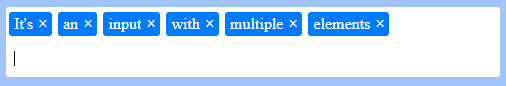

# input-multi-element
This is a module to simply add a input with multiple element to your site.



## Requirement :
* JQuery

## Install :
Load the required files.
Inside the page's head tag include the input-multi-element's CSS file.
``` html
<link rel="stylesheet" href="/your-path/input-multi-element.css">
```

And in the page's footer, include the required javascript files.
``` html
<script src="/your-path/input-multi-element.js"></script>
```

## Initialize :
For initialize the input-multi-element, insert this example snippet and update this with your parameters.
Exemple: 
``` js
$(document).ready(function() {
    InputMultiElement().init(
        "#input-multi-element",
        {
            maxElement: 50
        }
    );
});
```

## Options :
```
maxElement: [number]
```

## Fonctions :
- [inputMultiElement().init](#init)
- [inputMultiElement().setElement](#setElement)
- [inputMultiElement().setElements](#setElements)
- [inputMultiElement().getElements](#getElements)
- [inputMultiElement().getElementsDOM](#getElementsDOM)
- [inputMultiElement().getElementById](#getElementById)
- [inputMultiElement().getElementDOMById](#getElementDOMById)
- [inputMultiElement().getNbElements](#getNbElements)
- [inputMultiElement().deleteLastElement](#deleteLastElement)
- [inputMultiElement().deleteElementById](#deleteElementById)
- [inputMultiElement().deleteElementsByValue](#deleteElementsByValue)
- [inputMultiElement().updateElementsById](#updateElementsById)
- [inputMultiElement().updateElementsByValue](#updateElementsByValue)
- [inputMultiElement().hasElement](#hasElement)
- [inputMultiElement().nbElementByValue](#nbElementByValue)
- [inputMultiElement().activateTextZone](#activateTextZone)
- [inputMultiElement().clearTextZone](#clearTextZone)


__inputMultiElement().init__ <a name="init"></a>
``` js
/**
 * Used to create the input mutli element
 *
 * @param {string} _elem Class or id of the input mutli element
 * @param {Array} _opts List of options
 */
inputMultiElement.init(_elem, _opts)
```

__inputMultiElement().setElement__ <a name="setElement"></a>
``` js
/**
 * Used to set a element with a index or not
 *
 * @param {string} _text Text of the element
 * @param {number} _index Index of the element
 */
inputMultiElement.setElement(_text, _index)
```

__inputMultiElement().setElements__ <a name="setElements"></a>
``` js
/**
 * Used to set a array of elements with a index or not
 *
 * @param {Array} _texts Array of the string elements
 * @param {number} _index Index of the first element of the array
 */
inputMultiElement.setElements(_texts, _index)
```

__inputMultiElement().getElements__ <a name="getElements"></a>
``` js
/**
 * Used to get an array of string of elements
 *
 * @returns {Array} Returns an array of elements
 */
inputMultiElement.getElements()
```

__inputMultiElement().getElementsDOM__ <a name="getElementsDOM"></a>
``` js
/**
 * Used to get an array of DOM elements
 *
 * @returns {Array} Returns an array of DOM elements
 */
inputMultiElement.getElementsDOM()
```

__inputMultiElement().getElementById__ <a name="getElementById"></a>
``` js
/**
 * Used to get an element with an index
 *
 * @param {number} _index Index of the element
 * @returns {Array} Returns an element
 */
inputMultiElement.getElementById(_id)
```

__inputMultiElement().getElementDOMById__ <a name="getElementDOMById"></a>
``` js
/**
 * Used to get an DOM element with an index
 *
 * @param {number} _index Index of the element
 * @returns {Array} Returns a DOM element
 */
inputMultiElement.getElementDOMById(_id)
```

__inputMultiElement().getNbElements__ <a name="getNbElements"></a>
``` js
/**
 * Used to get a number of the elements
 *
 * @returns {number} Returns number of elements
 */
inputMultiElement.getNbElements()
```

__inputMultiElement().deleteLastElement__ <a name="deleteLastElement"></a>
``` js
/**
 * Used to delete the last element
 */
inputMultiElement.deleteLastElement()
```

__inputMultiElement().deleteElementById__ <a name="deleteElementById"></a>
``` js
/**
 * Used to delete an element with a index
 *
 * @param {number} _index Index of the element
 */
inputMultiElement.deleteElementById(_id)
```

__inputMultiElement().deleteElementsByValue__ <a name="deleteElementsByValue"></a>
``` js
/**
 * Used to delete an elements with a value
 *
 * @param {string} _values Value of the elements
 */
inputMultiElement.deleteElementsByValue(_value)
```

__inputMultiElement().updateElementsById__ <a name="updateElementsById"></a>
``` js
/**
 * Used to update an elements with an index
 *
 * @param {string} _value Value of the elements
 * @param {number} _index Index of the elements
 */
inputMultiElement.updateElementsById(_value, _id)
```

__inputMultiElement().updateElementsByValue__ <a name="updateElementsByValue"></a>
``` js
/**
 * Used to update an elements with a value
 *
 * @param {string} _newValue New value of the elements
 * @param {string} _lastValue Last value of the elements
 */
inputMultiElement.updateElementsByValue(_newValue, _lastValue)
```

__inputMultiElement().hasElement__ <a name="hasElement"></a>
``` js
/**
     * Used to know if an element exist
  *
  * @param {string} _value Value of the elements
  * @returns {boolean} Return true if the element exist if not false
  */
inputMultiElement.hasElement(_value)
```

__inputMultiElement().nbElementByValue__ <a name="nbElementByValue"></a>
``` js
/**
 * Used to get a number of the elements with a value
 *
 * @param {string} _value Value of the elements
 * @returns {number} Returns number of elements by value
 */
inputMultiElement.nbElementByValue(_value)
```

__inputMultiElement().activateTextZone__ <a name="activateTextZone"></a>
``` js
/**
 * Used to activate the text zone
 *
 * @param {boolean} _bool True to activate / False to desactivate 
 */
inputMultiElement.activateTextZone(_bool)
```

__inputMultiElement().clearTextZone__ <a name="clearTextZone"></a>
``` js
/**
 * Used to clear the text zone
 */
inputMultiElement.clearTextZone()
```
